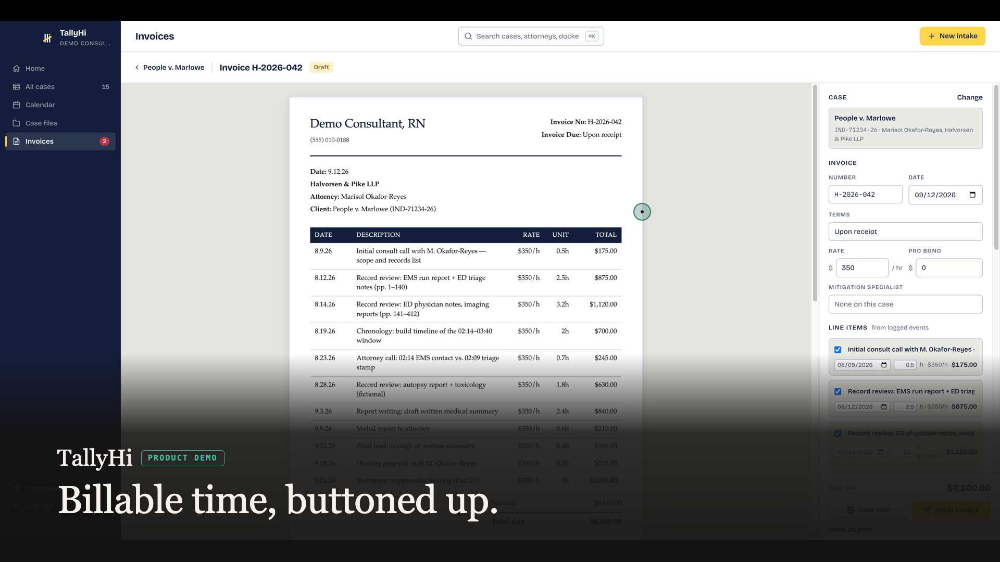

# walkthrough-video

A [Claude Code](https://code.claude.com/docs) Agent Skill that records a narrated product walkthrough video of a website,
web app, or Electron desktop app — no screen-recording app, no video editor, no manual timing.

You describe the video as a list of **beats** (a screen, what the cursor does, one sentence of narration). The skill
narrates the script, drives the app with Playwright while recording it, lines the speech up with the picture, burns
captions, cuts a thumbnail, and runs a QA pass that proves the timing. Re-narrating a line does not mean re-recording:
holds stretch to fit.

## Example output

The product walkthrough on the [TallyHi](https://tallyhi.com) homepage was made with this skill — recorded, narrated
and assembled from a beats file, with no screen-recording app or video editor involved. TallyHi is an Electron desktop
app, one of the app types the skill supports, and the demo runs entirely on fictional data.

[](https://tallyhi.com)

*The thumbnail above is the skill's own `thumbnail.png` output. Click it to watch the video.*

## What you get

```
deliverables/
  <name>.mp4              1920x1080, H.264 30 fps, AAC 48 kHz — upload this, attach the SRT
  <name>-captioned.mp4    same cut with burned-in captions, for players that cannot load an SRT
  <name>.srt              captions timed per sentence from the real clip lengths
  thumbnail.png           a frame from a beat you choose, with an optional title band
  narration-script.txt    what the voice actually read
  README.md               beat table, runtime, re-render commands, compliance notes
```

## Requirements

| | |
|---|---|
| **Node** | 22+ |
| **ffmpeg / ffprobe** | any recent build (`brew install ffmpeg`). libass is *not* needed — captions are PNG overlays |
| **Playwright Chromium** | `npx playwright install chromium` |
| **Narration** | nothing required. macOS `say` is used automatically when no API key is set. Set `ELEVENLABS_API_KEY` + `ELEVENLABS_VOICE_ID` for a publishable voice |

### Narration credentials

Two engines. With no credentials the skill uses the macOS `say` voice — free, offline, good enough for drafts and CI. With
credentials it uses ElevenLabs. Force either with `--engine say` / `--engine elevenlabs`.

Credentials are read in this order, first hit per variable wins:

1. the process environment
2. the project's env file (`envFile` in the config, default `./.env.local`)
3. `~/.config/walkthrough-video/.env` — **the recommended place**: set the key once and every project on the machine picks
   it up

```bash
mkdir -p ~/.config/walkthrough-video
printf 'ELEVENLABS_API_KEY=...\nELEVENLABS_VOICE_ID=...\n' > ~/.config/walkthrough-video/.env
chmod 600 ~/.config/walkthrough-video/.env
```

Never commit any of these files — `.env*` is in `.gitignore` for that reason, and the scripts never print their values.
On Linux/Windows with no key, render `vo/<id>.wav` with any tool you like, set `dur` per beat, and skip `tts.mjs`.

## Install

Claude Code loads personal skills from `~/.claude/skills/<name>/` (every repo) and project skills from
`<repo>/.claude/skills/<name>/` (that repo only).

```bash
# global — available in every repo
git clone https://github.com/Ranguana/walkthrough-video ~/.claude/skills/walkthrough-video
cd ~/.claude/skills/walkthrough-video && npm install && npx playwright install chromium

# or per project
git clone https://github.com/Ranguana/walkthrough-video .claude/skills/walkthrough-video
cd .claude/skills/walkthrough-video && npm install && npx playwright install chromium
```

`npm install` inside the skill folder is what lets the scripts find `playwright` from any working directory. Start a new
Claude Code session afterwards so the skill list is re-read.

## Quickstart (5 minutes)

In any repo, just ask:

> use the walkthrough-video skill to record a 90-second walkthrough of our landing page and demo flow

Claude discovers the routes and demo path, writes the two config files, renders, records, assembles and QAs. To drive it
by hand instead:

```bash
S=~/.claude/skills/walkthrough-video
mkdir -p video && cd video
cp $S/templates/walkthrough.config.example.json walkthrough.config.json
cp $S/examples/beats.minimal.json beats.json          # 2 beats against example.com

node $S/scripts/tts.mjs      --config walkthrough.config.json --dry-run   # see the spoken text, render nothing
node $S/scripts/tts.mjs      --config walkthrough.config.json             # vo/<id>.wav + "dur" per beat
node $S/scripts/record.mjs   --config walkthrough.config.json             # takes/take1/raw.webm + timings.json
node $S/scripts/assemble.mjs --config walkthrough.config.json             # deliverables/
node $S/scripts/qa.mjs       --config walkthrough.config.json             # checks + a frame per beat
```

That produces a ~12 second video. Then edit `beats.json` and re-run — `tts.mjs` only re-renders beats whose text changed.

## How it works

```
  beats.json ──► tts.mjs ──────────► vo/<id>.wav        (+ "dur" written back into beats.json)
       │            (ElevenLabs or macOS `say`, cached per beat)
       │
       ├────────► record.mjs ──────► takes/takeN/raw.webm      (web: Playwright recordVideo)
       │            (Playwright)     takes/takeN/frames/       (Electron or --frames: timestamped PNGs)
       │                             takes/takeN/timings.json  <- first frame of every beat
       │
       └────────► assemble.mjs ────► deliverables/<name>.mp4, -captioned.mp4, .srt, thumbnail.png
                    (ffmpeg)          1. master at 30 fps
                                      2. splice any still-frame beats
                                      3. freeze last frame where narration outgrew its beat
                                      4. lay each clip 0.5 s after its beat's first frame, mix
                                      5. captions (PNG overlays) + thumbnail + README
                              │
                              └──────► qa.mjs ──► qa/frames/<id>.png + report.json
                                        (speech onset, track lengths, per-beat slack)
```

Each beat is held on screen for at least `voLead + dur + pad`, so the picture always outlasts the sentence. Because
`assemble.mjs` freezes frames rather than speeding audio, you can rewrite narration all day without touching the take.

## Beats file reference

`beats.json` is an array. One beat = one screen with one sentence of narration.

```json
{
  "id": "02-upload",
  "screen": "Demo — upload step",
  "text": "This is the public demo… a fictional sample file. Nothing is saved.",
  "pad": 0.8,
  "actions": [
    { "goto": "/demo" },
    { "hover": { "role": "button", "name": "Use sample" }, "for": 1.2 },
    { "holdNarration": 0.8 },
    { "click": "text=Use sample" },
    { "waitFor": "h1:has-text(\"Review\")" }
  ]
}
```

| Field | Meaning |
|---|---|
| `id` | stable and ordered (`01-hook`, `02-upload`). Names the vo clip, the QA frame, the timings entry |
| `screen` | one line for the deliverables README |
| `text` | the written/caption form — what appears in the SRT |
| `spoken` | optional override of what the voice reads (else derived from `text` via `spokenMap`) |
| `dur` | **filled in by `tts.mjs`** — leave it out |
| `pad` | silence after the narration before the next beat (default from the config) |
| `hold` | minimum beat length even with no narration |
| `autoHold` | `false` to opt out of the automatic end-of-beat hold |
| `kind` | `"stills"` for a beat built from screenshots instead of actions (see `stills.mjs`) |
| `actions` | run in order; **all times in seconds** |

Actions: `goto`, `waitFor`, `waitUrl`, `wait`, `mouse`, `hover`, `click`, `type` (with `env` for secrets), `press`,
`select` (with `menu: true`), `upload`, `scroll`, `scrollIntoView`, `scrollEl`, `zoom`, `highlight` / `unhighlight`,
`card`, `dialog`, `eval`, `screenshot`, `holdNarration`. Each is documented with its options at the top of
`scripts/record.mjs`.

Targets are Playwright selector strings (`"text=Sign in"`, `"#email"`, `"h1:has-text(\"Review\")"`) or objects —
`{ role, name, exact }`, `{ text }`, `{ label }`, `{ placeholder }`, `{ testId }` — optionally with `nth`.

## Electron apps

Set an Electron target and the same beats file drives a desktop app:

```json
{ "target": { "type": "electron", "appPath": "dist/mac-arm64/My App.app", "args": [], "cwd": "." } }
```

The app is launched with Playwright's Electron support and driven with the identical action DSL. Differences: no `goto`
(the window is already loaded — navigate with the app's own UI); no `recordVideo`, so the take is captured as a
timestamped PNG sequence and rebuilt into an exact wall-clock timeline at assembly; capture runs at `framesFps`
(default 8) because screenshots cost 50-150 ms each; and the window must be 1920x1080 for a sharp result — set it in the
app's own `BrowserWindow` options, since `record.mjs` can only ask the main process to resize and warn if it could not.
See `examples/electron-beats.example.json`.

## Troubleshooting

**A native `confirm()` or `alert()` freezes everything.** The page blocks until the dialog is answered, and the dialog is
never in the video. `record.mjs` auto-answers using `config.dialogs` (`accept` by default) or a `{ "dialog": "dismiss" }`
action. If the viewer should *see* a confirmation, show a `card` or hover the button without clicking. In the user's own
Chrome (via the Claude-in-Chrome extension) a native dialog blocks the *tools* until a human clicks it — warn the user
before an action that raises one.

**A native `<select>` opens nothing on screen.** Headless Chromium never paints native popups. Use
`{ "select": "#kind", "value": "x", "menu": true, "hoverValues": ["a","b"] }` — the recorder draws the select's own
options as an on-screen list, moves the cursor over them, then calls `selectOption` for real.

**The Chrome-extension profile trap.** When capturing stills from the user's own browser, the extension must be connected
from the **same Chrome profile that holds the login**. A signed-out page means the wrong profile is connected — reconnect
from the right one rather than trying to sign in inside the take.

**The GIF recorder caps at ~50 frames.** That is a couple of seconds at low resolution. Do not use it for anything longer
than a click-and-response. Take high-resolution screenshots of each state instead, list them in `shots.json`, and let
`stills.mjs` compose them into a clip with cursor halos and crossfades.

**Narration is longer than its beat.** Expected, and handled: `assemble.mjs` freezes the beat's last frame to fit rather
than speeding the audio up. The summary prints per-beat slack; `TIGHT` means under `tail` seconds of silence at the end —
usually fine, but re-record that beat if visible motion got cut off.

**No cursor in the recording.** Correct — headless recordings have no real cursor. The halo overlay stands in for it, and
it is injected into the page, so a beat that never moves the mouse shows no halo. Add a `{ "mouse": [x, y] }` to place it.

**A beat's selector broke.** Action errors are logged to `takes/takeN/notes.json` and the take continues (exit code 1), so
you see every failure in one run. Re-run with `--headed` to watch it, or `--only 03-review` for one beat.

**Downloads do not appear.** Generated files stream to the browser and are invisible. Narrate "one click generates…" over
a hover, or click and let the app's own "generated" state show.

**Real side effects.** Hover, never click, anything that sends email, charges a card, or creates a real record — and say
so in the deliverables README.

## Layout

```
walkthrough-video/
  SKILL.md          the procedure Claude follows (frontmatter: name, description, license, metadata)
  README.md         this file
  LICENSE           MIT
  package.json      playwright + dotenv; npm scripts for each stage
  scripts/
    lib.mjs         config, target resolution, env chain, ffprobe, beats/takes I/O
    tts.mjs         beats.json -> vo/<id>.wav (ElevenLabs or macOS `say`), cached per beat
    record.mjs      beats.json -> takes/takeN/{raw.webm | frames/} + timings.json   (Playwright)
    assemble.mjs    take + vo -> deliverables/                                       (ffmpeg)
    qa.mjs          per-beat frames, speech-onset check, duration match
    stills.mjs      screenshots + shots.json -> a silent clip assemble.mjs splices in
  templates/
    walkthrough.config.example.json
    beats.example.json          a full 6-beat walkthrough showing every action type
    shots.example.json
    narration-style.md          tone, humanization, number reading, the close
  examples/
    beats.minimal.json          2 beats against example.com — the quickstart
    electron-beats.example.json 2 beats against an Electron app
    README.md                   what each example produces
```

## License

MIT — see [LICENSE](LICENSE).
